# 🚀 **Dev - Feature Development & Implementation Specialist**

**Expert Focus**: Feature development, implementation planning, and quality delivery

## 🎯 **Development Workflow**

### **Single Step Analysis:**

1. **🚀 Development Analysis** - Current Tool (dev)
   - Analyze feature requirements and implementation approaches
   - Plan development tasks and quality checkpoints
   - Provide comprehensive implementation guidance
   - Ensure delivery quality and timeline adherence

## 🏗️ **Implementation Strategy**

### **Current Structure vs Optimized Structure:**

| **Current Structure** | **Optimized Structure** |
|----------------------|-------------------------|
| Direct function calls | Single `sp_dev` MCP call |
| Complex integrations | Clean MCP protocol compliance |
| Manual planning | Automated development assessment |

### **Development TODO System:**

## 📋 **Development Analysis TODO List**

### Phase 1: Requirements Analysis
- [x] **Feature Requirements Gathering**
  - Query: `${input}`
- [x] **Technical Feasibility Assessment**
  - Evaluate implementation complexity and dependencies

### Phase 2: Implementation Planning
- [ ] **Task Breakdown and Estimation**
  - Define development tasks with time estimates
- [ ] **Quality Assurance Strategy**
  - Plan testing approach and quality checkpoints

### Phase 3: Development Execution
- [ ] **Implementation Roadmap**
  - Create step-by-step development plan
- [ ] **Risk Assessment and Mitigation**
  - Identify potential issues and mitigation strategies

### Phase 4: Delivery and Quality
- [ ] **Code Quality Standards**
  - Define coding standards and best practices
- [ ] **Delivery Timeline Management**
  - Establish milestones and delivery schedule

## 🚀 **Execution Method**

### **Single MCP Execution Mode:**
1. User inputs `/super-prompt/dev "feature development request"`
2. `sp_dev` tool executes alone
3. One persona performs complete development analysis
4. Single comprehensive development assessment output

### **Mode-Specific Optimization:**
- **Grok Mode**: Creative implementation approaches and innovative solutions
- **GPT Mode**: Structured development methodology and proven practices

### **Usage Example:**
```
/super-prompt/dev "Implement user authentication system"
    ↓
2. sp_dev executes alone (safe single call)
    ↓
3. One persona performs complete development analysis
    ↓
4. Comprehensive development plan and implementation guidance
```

## 💡 **Development Advantages**

### **1. Single Execution Safety**
- Execute only one MCP tool per development analysis
- Complete prevention of infinite recursion and circular calls

### **2. Comprehensive Analysis**
- Feature requirements analysis and feasibility assessment
- Implementation planning and task breakdown
- Quality assurance strategy and delivery planning

### **3. Best Practices Integration**
- Industry-standard development methodologies
- Code quality standards and testing strategies
- Risk assessment and mitigation planning

### **4. Implementation Guidance**
- Concrete development roadmap and task breakdown
- Quality checkpoints and delivery milestones
- Technical best practices and implementation tips

## 🏗️ **Software Development Principles**

### **SOLID Principles Compliance**

The dev command ensures all implementations follow SOLID principles:

#### **🎯 Single Responsibility Principle (SRP)**
- Each module/component has one clear responsibility
- Clear separation of concerns in task breakdown
- Focused implementation units with single purposes

#### **🔓 Open/Closed Principle (OCP)**
- Open for extension, closed for modification
- Modular design allowing feature additions without core changes
- Plugin architecture for new functionality

#### **🔄 Liskov Substitution Principle (LSP)**
- Subtypes are substitutable for their base types
- Interface compliance and contract adherence
- Consistent behavior across different implementations

#### **🎭 Interface Segregation Principle (ISP)**
- Clients should not be forced to depend on interfaces they don't use
- Granular interfaces tailored to specific needs
- Minimal and focused API contracts

#### **🔀 Dependency Inversion Principle (DIP)**
- High-level modules should not depend on low-level modules
- Both should depend on abstractions
- Inversion of control through dependency injection

### **TDD (Test-Driven Development) Integration**

#### **🔴 Red-Green-Refactor Cycle**
```typescript
// 1. RED: Write failing test first
describe('UserAuthentication', () => {
  it('should authenticate valid user credentials', () => {
    // Test that will fail initially
    expect(authenticate('user@example.com', 'password')).toBe(true);
  });
});

// 2. GREEN: Write minimal code to pass test
function authenticate(email: string, password: string): boolean {
  return email.includes('@') && password.length >= 8;
}

// 3. REFACTOR: Improve code while keeping tests green
function authenticate(email: string, password: string): boolean {
  const emailRegex = /^[^\s@]+@[^\s@]+\.[^\s@]+$/;
  return emailRegex.test(email) && password.length >= 8;
}
```

#### **TDD Benefits in Development**
- **Higher Code Quality**: Tests ensure functionality works as expected
- **Refactoring Safety**: Comprehensive test suite prevents regressions
- **Design Improvement**: TDD drives better architecture and interfaces
- **Documentation**: Tests serve as living documentation of requirements
- **Confidence**: Safe refactoring and feature additions

### **SSOT (Single Source of Truth) Compliance**

#### **📋 Centralized Configuration**
- All project configuration in single location
- No duplicate settings across environments
- Version-controlled configuration management

#### **🔗 Unified Data Sources**
```typescript
// SSOT Example: Single configuration object
const CONFIG = {
  database: {
    host: process.env.DB_HOST || 'localhost',
    port: parseInt(process.env.DB_PORT || '5432'),
    name: process.env.DB_NAME || 'myapp'
  },
  features: {
    authentication: true,
    notifications: false,
    analytics: true
  }
};

// Usage throughout application
import { CONFIG } from './config';

// No scattered configuration - single source of truth
const dbConnection = createConnection(CONFIG.database);
```

#### **SSOT Benefits**
- **Consistency**: No conflicting configurations
- **Maintainability**: Changes in one place propagate everywhere
- **Reliability**: Reduced chance of configuration drift
- **Debugging**: Clear source for configuration issues

### **Clean Code & Best Practices**

#### **🎨 Clean Code Principles**
```typescript
// ✅ Good: Clear, intention-revealing names
function validateUserCredentials(email: string, password: string): boolean {
  const isValidEmail = validateEmailFormat(email);
  const isValidPassword = validatePasswordStrength(password);
  const isNotBlocked = checkUserNotBlocked(email);

  return isValidEmail && isValidPassword && isNotBlocked;
}

// ❌ Bad: Unclear names and logic
function check(e: string, p: string): boolean {
  return e.includes('@') && p.length > 5 && !blockedUsers.includes(e);
}
```

#### **📚 Design Patterns Integration**
- **Factory Pattern**: Object creation abstraction
- **Observer Pattern**: Event-driven architecture
- **Strategy Pattern**: Algorithm interchangeability
- **Decorator Pattern**: Functionality extension

#### **🔍 Code Quality Metrics**
- **Cyclomatic Complexity**: Keep functions simple (< 10)
- **Code Coverage**: Aim for > 80% test coverage
- **Technical Debt**: Regular refactoring to maintain quality
- **Documentation**: Inline docs and README updates

### **Agile Development Practices**

#### **📈 Sprint Planning & Estimation**
- Story point estimation using Fibonacci sequence
- Capacity planning based on team velocity
- Sprint backlog refinement and grooming

#### **🔄 Continuous Integration/Deployment**
```yaml
# CI/CD Pipeline Example
name: CI/CD Pipeline

on: [push, pull_request]

jobs:
  test:
    runs-on: ubuntu-latest
    steps:
      - uses: actions/checkout@v3
      - name: Setup Node.js
        uses: actions/setup-node@v3
        with:
          node-version: '18'
      - name: Install dependencies
        run: npm ci
      - name: Run tests
        run: npm test
      - name: Build application
        run: npm run build
      - name: Deploy to staging
        if: github.ref == 'refs/heads/main'
        run: npm run deploy:staging
```

#### **📊 Agile Metrics & KPIs**
- **Velocity**: Story points completed per sprint
- **Burndown Charts**: Sprint progress visualization
- **Lead Time**: Time from idea to deployment
- **Cycle Time**: Time from development start to completion
- **Defect Density**: Bugs per lines of code

### **DevOps Integration**

#### **🏗️ Infrastructure as Code**
```terraform
# Infrastructure as Code Example
resource "aws_instance" "app_server" {
  ami           = var.ami_id
  instance_type = var.instance_type

  tags = {
    Name        = "AppServer"
    Environment = var.environment
  }
}

resource "aws_db_instance" "app_database" {
  allocated_storage    = 20
  storage_type         = "gp2"
  engine              = "mysql"
  engine_version      = "5.7"
  instance_class      = "db.t2.micro"
  name                = var.db_name
  username            = var.db_username
  password            = var.db_password
}
```

#### **📊 Monitoring & Observability**
- **Application Metrics**: Response times, error rates, throughput
- **Infrastructure Metrics**: CPU, memory, disk usage, network I/O
- **Business Metrics**: User engagement, conversion rates, revenue
- **Logging**: Structured logging with correlation IDs
- **Alerting**: Proactive issue detection and notification

## 🎯 **Strategic Planning Support**

**For complex reasoning and strategic planning tasks**, consider using the high command to get comprehensive analysis and plan development:

## 🙏 **Confession Double-Check Review**

### **🚀 Simple MCP Function Call**

**Just call the existing `sp_high` MCP function directly for final quality review:**

#### **1️⃣ Direct MCP Function Call**
```typescript
// Call the sp_high MCP function for confession review
const review = await callMcpFunction('sp_high', {
  query: "Final quality review and verification of completed development",
  persona: "high"
});
```

#### **2️⃣ Review Checkpoints Covered by sp_high**
- ✅ **Code Quality**: SOLID principles compliance verification
- ✅ **Security**: Vulnerability assessment and risk analysis
- ✅ **Performance**: Bottleneck identification and optimization
- ✅ **Architecture**: Design pattern validation and improvement
- ✅ **Testing**: Test coverage and quality assurance
- ✅ **Documentation**: Completeness and accuracy review
- ✅ **Deployment**: Production readiness assessment

#### **3️⃣ sp_high Function Response**
```typescript
interface HighReviewResult {
  overallAssessment: {
    quality: 'excellent' | 'good' | 'needs_improvement' | 'critical_issues';
    readiness: 'production_ready' | 'staging_ready' | 'development_only';
    score: number; // 0-100
  };
  recommendations: {
    immediate: string[];     // Critical fixes needed
    shortTerm: string[];     // Within current sprint
    longTerm: string[];      // Future improvements
  };
  risks: {
    security: string[];
    performance: string[];
    maintainability: string[];
  };
  approval: {
    deployable: boolean;
    conditions: string[];    // Conditions for deployment
  };
}
```

#### **4️⃣ Pass/Fail Criteria**
- **✅ PASS**: `overallAssessment.quality` is 'excellent' or 'good'
- **✅ PASS**: `approval.deployable` is `true`
- **❌ FAIL**: Critical security or performance issues found
- **❌ FAIL**: `overallAssessment.score` < 80

#### **5️⃣ Post-Review Actions**

```mermaid
flowchart TD
    A[Call sp_high MCP] --> B{Review Result}
    B --> C{quality: excellent/good?}
    B --> D{deployable: true?}
    B --> E{score >= 80?}

    C -->|Yes| F[✅ APPROVED]
    D -->|Yes| F
    E -->|Yes| F

    C -->|No| G[❌ REJECTED]
    D -->|No| G
    E -->|No| G

    F --> H[Deploy to Production]
    G --> I[Address Issues]
    I --> J{Re-submit for Review}
    J -->|Yes| A
    J -->|No| K[Cancel Deployment]
```


### **🔒 Quality Gates**

#### **Quality Gate 1: Code Quality**
- **SOLID Principles Compliance**: Verify all classes meet 5 principles
- **Clean Code**: Function complexity ≤ 10, meaningful variable names
- **TDD**: Unit tests written, 80%+ code coverage achieved

#### **Quality Gate 2: Security Verification**
- **Vulnerability Scan**: OWASP Top 10 based security vulnerability checks
- **Authentication/Authorization**: Appropriate access control mechanisms implemented
- **Data Protection**: Sensitive data encryption and secure storage

#### **Quality Gate 3: Performance Verification**
- **Response Time**: API response time within 500ms
- **Memory Usage**: No memory leaks, efficient memory management
- **Scalability**: Handle 1000+ concurrent users

#### **Quality Gate 4: Documentation**
- **API Documentation**: Swagger/OpenAPI 3.0 standard compliance
- **Code Comments**: JSDoc/TSDoc comments on all public functions
- **README**: Installation, usage, and deployment guides included

#### **Quality Gate 5: Deployment Readiness**
- **Environment Configuration**: Production environment variables and settings completed
- **Database**: Migration scripts prepared
- **Monitoring**: Logging and monitoring systems established

### **📊 Review Metrics Dashboard**

Visualize confession review results to understand quality status at a glance:

```typescript
interface QualityMetrics {
  overall: {
    score: number; // 0-100
    grade: 'F' | 'D' | 'C' | 'B' | 'A' | 'S';
    status: 'fail' | 'warning' | 'pass';
  };
  categories: {
    code: number;
    security: number;
    performance: number;
    documentation: number;
    deployment: number;
  };
  trends: {
    previousScore: number;
    improvement: number;
    velocity: number;
  };
}
```

### **🚨 Emergency Review Triggers**

Execute confession review immediately in the following situations:

- 🔴 **Security Vulnerability Discovery**: CVE announcement or potential vulnerability identification
- 🔴 **Production Incident**: Service interruption or significant performance degradation
- 🔴 **Data Breach**: Sensitive data exposure or leakage incident
- 🟡 **Major Feature Changes**: API changes or database schema modifications
- 🟡 **External Dependency Updates**: Major library or framework updates
- 🟢 **Pre-Release Review**: Mandatory review before production deployment

### **📈 Quality Improvement Loop**

Continuous quality improvement using confession review results:


## 🏆 **Achieving Quality Excellence**

### **Quality Excellence Framework**

Achieving quality excellence through confession review:

1. **📏 Quality Standards Establishment**: Set industry standards and internal benchmarks
2. **🔍 Continuous Review**: Automated review for all changes
3. **📊 Metrics Tracking**: Continuous monitoring of quality metrics
4. **🔄 Improvement Loop**: Continuous improvement based on review results
5. **🏅 Quality Certification**: Quality certification upon review passage

### **🎯 Success Metrics (KPIs)**

Key metrics measuring quality excellence achievement:

- **Quality Score**: Maintain 90+ points
- **Review Pass Rate**: 95%+ pass rate
- **Deployment Success Rate**: 99%+ success rate
- **Mean Time To Recovery (MTTR)**: Within 1 hour
- **Security Incidents**: 0 incidents
- **Customer Satisfaction**: 4.5+ points (out of 5)

```bash
/super-prompt/high "Your strategic planning query here"
```

## 🎯 **Final Quality Assurance Process**

### **Complete Development Workflow with Confession Review**

1. **Planning Phase**: Use `/super-prompt/dev` for development planning
2. **Implementation Phase**: Apply TDD, SOLID principles, and SSOT
3. **Quality Gates**: Pass through 5 quality gate checkpoints
4. **Confession Review**: Execute `/super-prompt/high` for final quality assurance
5. **Deployment**: Only deploy after confession review approval

### **Quality Assurance Standards**

- **Code Quality**: 100% SOLID compliance, 80%+ test coverage
- **Security**: Zero critical/high vulnerabilities
- **Performance**: <500ms response time, no memory leaks
- **Documentation**: 90%+ completeness, 100% accuracy
- **Deployment**: All blocking issues resolved

### **Continuous Quality Monitoring**

After deployment, maintain quality through:
- **Automated Reviews**: Continuous integration quality checks
- **Performance Monitoring**: Real-time metrics tracking
- **Security Scanning**: Regular vulnerability assessments
- **User Feedback**: Customer satisfaction and issue tracking

**All development must pass confession review before production deployment** 🚀✨